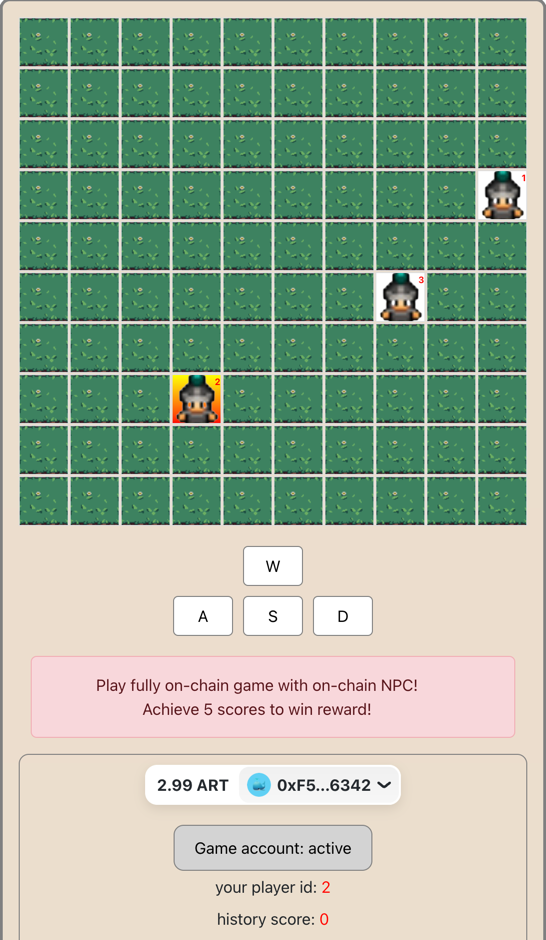

# JIT (Just-in-Time) Gaming

Welcome to JIT Gaming, where we introduce Royale, a fully on-chain PvP (Player vs. Player) game that brings competitive gaming directly to the blockchain. In Royale, players navigate characters across a dynamic map, engaging in battles when paths cross. Victorious players are rewarded with points, enhancing the competitive spirit of the game.



To keep the competition fierce and engaging, Royale introduces NPC (Non-Player Character) players through Aspect, a novel extension layer developed by Artela for EVM (Ethereum Virtual Machine). This innovation ensures the game remains challenging and fun by adding NPCs each time a new game started. Aspect, acting as a coprocessor to the EVM, manages the NPC players' data and movement calculations seamlessly on-chain, without relying on off-chain components.

## Explore Royale: Live Demo

Experience Royale firsthand and dive into the action at: [https://jit-gaming-wje9.vercel.app/](https://jit-gaming-wje9.vercel.app/).

## Build and deploy the game on your local network

Follow these steps to set up and run the game:

### Step 1: Build the Contract

To compile the Royale game smart contract, execute the following command. This process generates the necessary artifacts in the `contracts/build/contract` directory.

```shell
npm run fcontract:build2
```

### Step 2: Build Aspect and Deploy the Contract

This step involves building the NPC player Aspect and deploying both the game contracts and Aspects to your chosen network.

```shell
npm run aspect:build && node tests/test_tx.cjs
```

Upon successful execution, the output will display both the contract and aspect addresses in the console, indicating that the game is ready to play.
